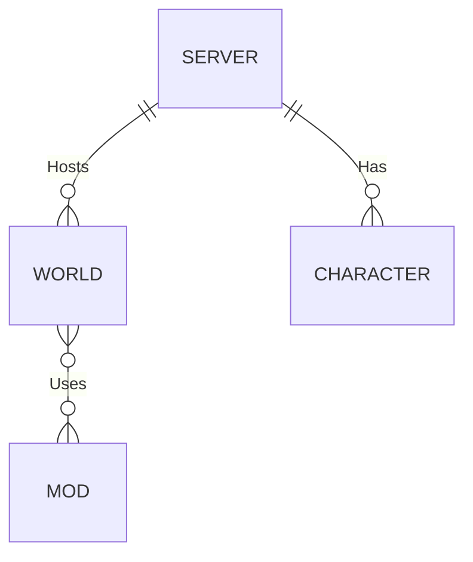
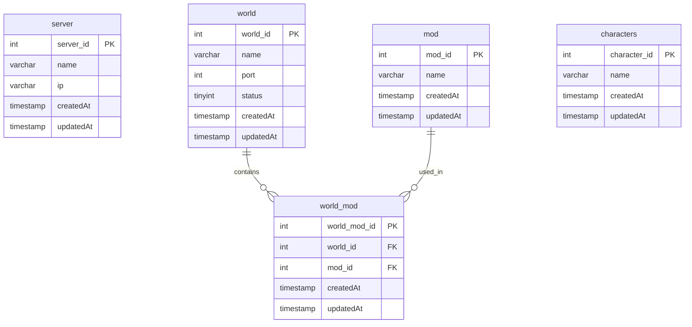

# ERD

```mermaid
erDiagram
    "SERVER" ||--o{ "WORLD" : "Hosts"
    "WORLD" }o--o{ "MOD" : "Uses"
    "SERVER" ||--o{ "CHARACTER" : "Has"
```
#

```mermaid
erDiagram
    server {
        int server_id PK
        varchar name
        varchar ip
        timestamp createdAt
        timestamp updatedAt
    }
    
    world {
        int world_id PK
        varchar name
        int port
        tinyint status
        timestamp createdAt
        timestamp updatedAt
    }
    
    mod {
        int mod_id PK
        varchar name
        timestamp createdAt
        timestamp updatedAt
    }
    
    world_mod {
        int world_mod_id PK
        int world_id FK
        int mod_id FK
        timestamp createdAt
        timestamp updatedAt
    }
    
    characters {
        int character_id PK
        varchar name
        timestamp createdAt
        timestamp updatedAt
    }
    
    world ||--o{ world_mod : "contains"
    mod ||--o{ world_mod : "used_in"
```