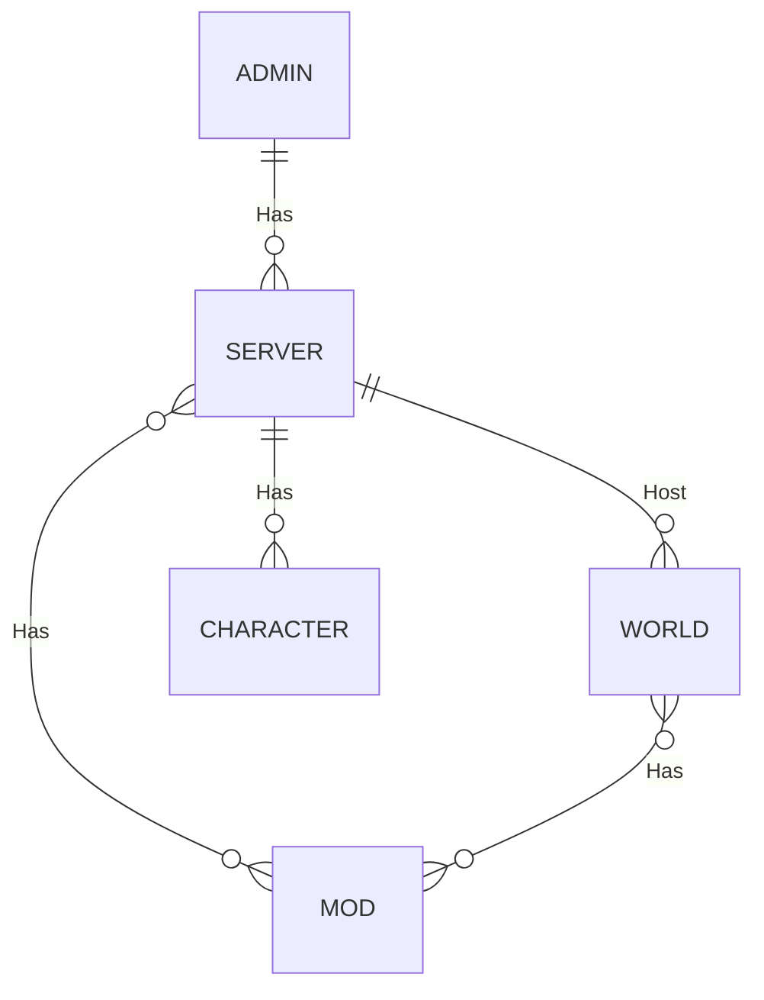
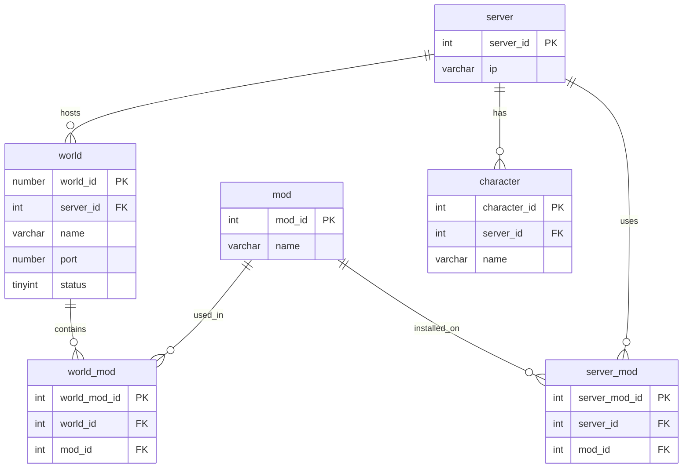

# ERD

```mermaid
erDiagram
    "ADMIN" ||--o{ "SERVER" : "Has"
    "SERVER" ||--o{ "WORLD" : "Host"
    "SERVER" }o--o{ "MOD" : "Has"
    "WORLD" }o--o{ "MOD" : "Has"
    "SERVER" ||--o{ "CHARACTER" : "Has"
```
#

```mermaid
erDiagram
    server {
        int server_id PK
        varchar ip
    }
    
    world {
        number world_id PK
        int server_id FK
        varchar name
        number port
        tinyint status
    }
    
    mod {
        int mod_id PK
        varchar name
    }
    
    server_mod {
        int server_mod_id PK
        int server_id FK
        int mod_id FK
    }
    
    world_mod {
        int world_mod_id PK
        int world_id FK
        int mod_id FK
    }

    character {
        int character_id PK
        int server_id FK
        varchar name
    }
    
    server ||--o{ world : "hosts"
    server ||--o{ server_mod : "uses"
    server ||--o{ character : "has"
    mod ||--o{ server_mod : "installed_on"
    mod ||--o{ world_mod : "used_in"
    world ||--o{ world_mod : "contains"
```